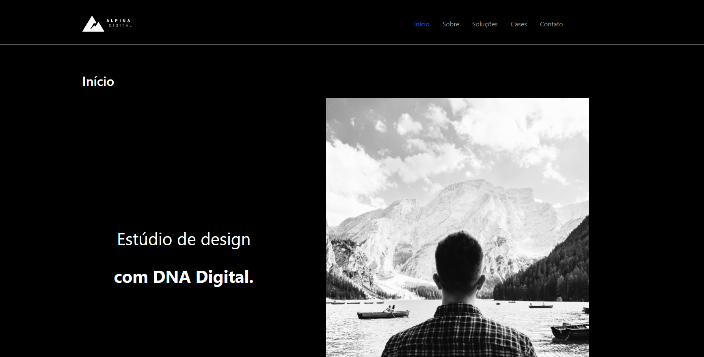
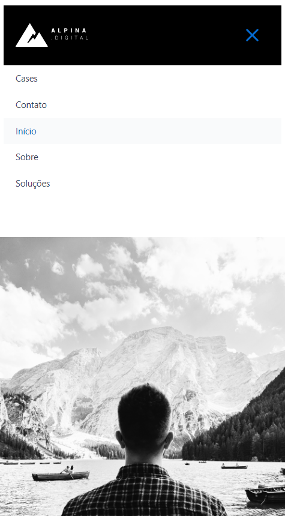

<h1 align="center">Web Site - Alpina Digital</h1>

**<p align="center">Sumário</p>**
<p align="center">
<a href="#dart-sobre">Sobre</a> &#xa0; | &#xa0;
<a href="#computer-tecnologias">Tecnologias</a>
</p>
<p align="center">
<a href="#hammer_and_wrench-serviços">Serviços</a> &#xa0; | &#xa0;
<a href="#scroll-rodando-o-projeto">Rodando o projeto</a> &#xa0; | &#xa0;
<a href="#sparkles-autor">Autor</a>
</p>

&#xa0;
 
## :dart: Sobre
<p>Este WEB Site é fruto de um teste técnico para desenvolvedor web, utilizando Wordpress como gestor de conteúdos.</p>
<strong>Layout desenvolvido no Figma a ser seguido:</strong>
<div align="center">

</div>

<h1 align="center">Resultado</h1>
<div align="center">

### Desktop


</div>

<div align="center">

### Mobile


</div>


&#xa0;

## :computer: Tecnologias
* [HTML](https://developer.mozilla.org/pt-BR/docs/Web/HTML)

* [CSS](https://www.w3schools.com/css/)

* [JavaScript](https://www.javascript.com/)

* [Wordpress](https://br.wordpress.org/)

&#xa0;

## :hammer_and_wrench: Serviços
* <a href="https://github.com/">GitHub</a>

&#xa0;

## :scroll: Rodando o projeto
É necessário um navegador, e um servidor, neste caso utilizaremos o Wamp Server.
Baixar e instalar o Wamp Server.

```bash
# Baixar a versão 5.6 do Wordpress

# Clone este repositório
$ git clone https://github.com/viniciuslemos93/alpina-wp.git

# Copiar e colar este repositório baixado dentro do diretório "www" no caminho que o Wamp Server está instalado

# Iniciar os serviços do Wamp Server

# Criar um banco de dados para poder iniciar a aplicação

# Acessar no navegador:
http://localhost/alpina-wp


```

&#xa0;

## :sparkles: Autor

<h4>Desenvolvido por Vinicius Lemos</h4>

<a href="https://github.com/viniciuslemos93">

</a>

&#xa0;

[](https://www.linkedin.com/in/viniciuslemos93/)<br>
